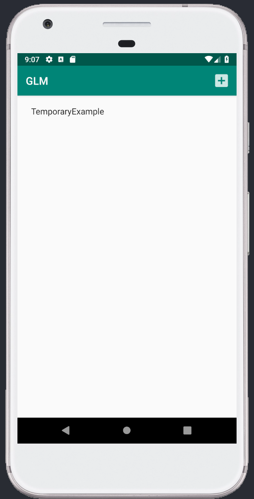
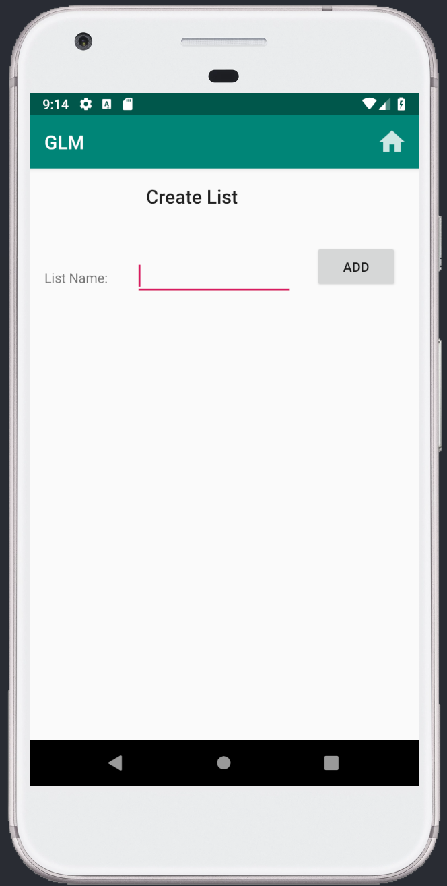
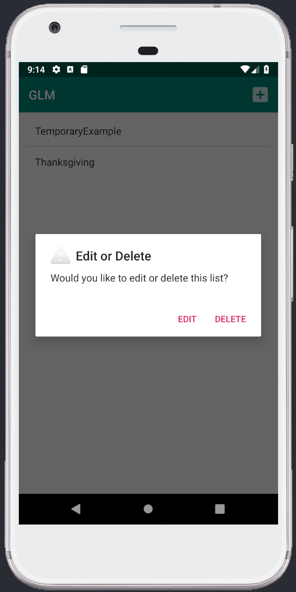
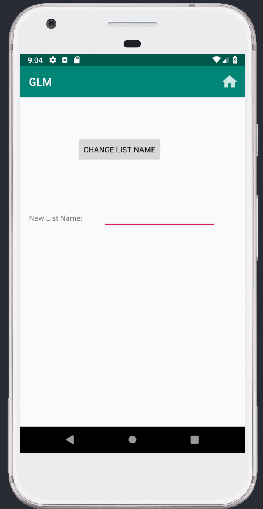
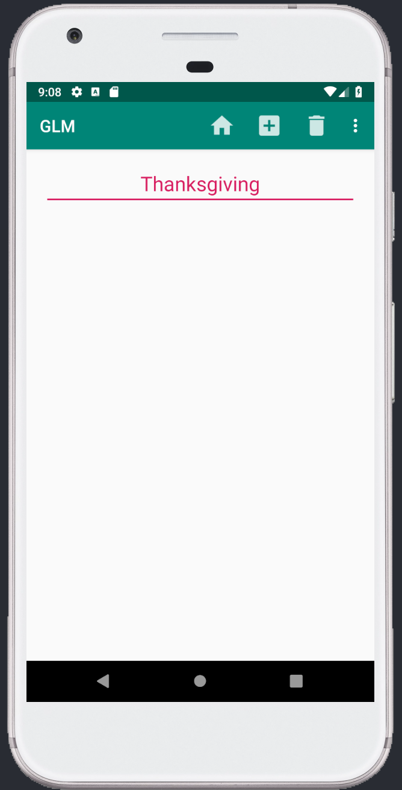
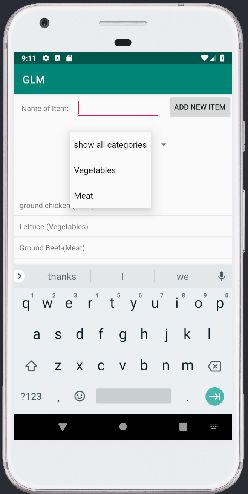
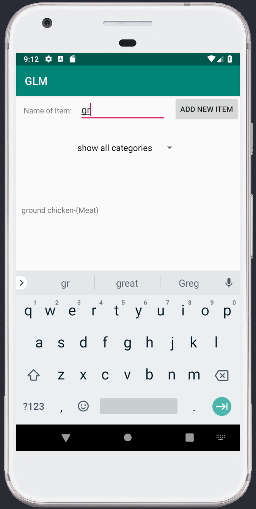
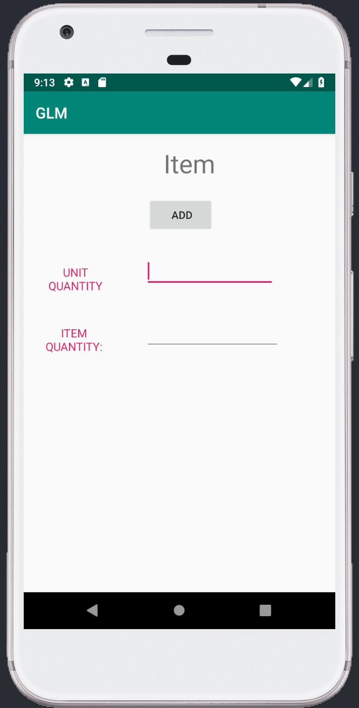
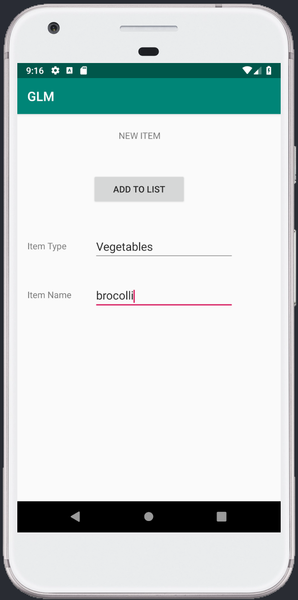
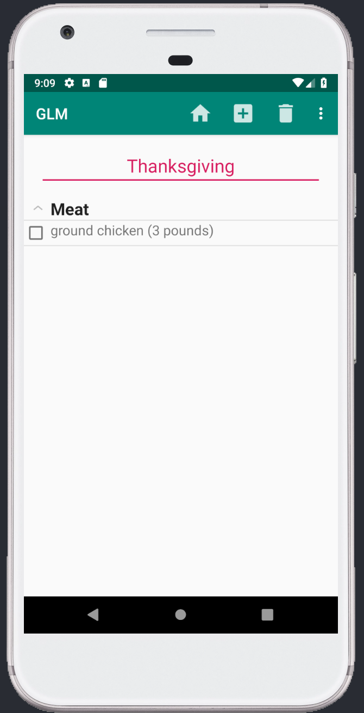

# User Manual

## My Grocery Lists Page

When initially opening the GLM app, this will be the first window that you sees. It contains a list of the your current grocery lists. We will refer to this page as the Main Page throughout the rest of this manual. There are four main activities that you can do on this page:
1. Tap one of the lists to see the items that are in that list.
  - (opens a new page)
2. Tap the "__+__" button to Add a new list.
  - (opens a new page)
3. Press and hold the list to open a toast that allows you to rename that list.
  - (opens a new page)
4. Press and hold the list to open up the same toast to edit, but instead you can choose the option __DELETE__ to remove the list (and by default, all the items within that list).
  - (no new page) the list is simply removed from the user's current lists.

Now we will dive into the pages of the that might open upon tapping some of the buttons listed above as we progress through this manual. Let's start with the Add New List button.

## Create List Page

This page should be simple enough to grasp; it really only contains one piece of functionality: naming your new list. Type in the name you want for your list (eg. Thanksgiving dinner, Joey's Birthday, July 4th BBQ, etc.). Once you're set on your list name, you can tap the __ADD__ button to save the new list. The button will lead you back to the main Grocery Lists page, where your new list will now appear.

If only tapped the "__+__" button accidentally or if you decide you don't want to create a new list anymore, just tap the __HOME__ button on the top right of the screen to go back to the main page.

On the main page, you can also __EDIT__ the names of lists or __DELETE__ lists that you have already by pressing and holding that list. You will see a pop-up that looks like the following:

## Edit or Delete List

Deleting the list is pretty self-explanatory. Once you tap __DELETE__, you will be led back to a refreshed main page where you'll see your list has disappeared. Be cautious when deleting a list though, because deleing a list will cause your items within that list to be deleted as well.

Alternatively from deleting a list, you can also rename a list (press and hold a list on the main page, then choose __EDIT__ on the pop-up that comes up).  It will lead you to the following page:

## Rename List Page

The functionality on this page is extremely similar to the Create New List page that we previously went through. You simply type in the name that you want your list to be called, then you can either tap the __HOME__ button to cancel the renaming process and go back to the main page, or you can tap the __CHANGE LIST NAME__ button to save the new name and go back to the main page.

Now that we've covered the basics of adding, removing, and renaming your lists, let's go into a list to see the what else we can do in this app. Tap on a list, and it will lead you to a page that contains that list's current items. Here is what it should look like:

## Grocery List Items Page

There are a number of things you can do on this page. We are going to start with the "__+__" button, which - you guessed it, lets you add a new item to your current list. It will lead you to another page where you can choose the category that your item belongs to. For example:
 - MEAT: chicken breasts, steaks, ground beef, chicken wings, etc.
 - FRUIT: apples, oranges, bananas, lemons, etc.
 - VEGETABLES: carrots, celery, lettuce, spinach, etc.

And of course, you'll be able to search for an item directly as well. Here is what the page should look like:

## Search Item Types Page

One of the first things you'll notice is a search bar. Underneath it, you will see a button called __show all categories__. When you click it, you will be shown the list of all possible ItemTypes to choose from. By choosing an itemType, you can view groups of similar items rather than having to search for a specific item. The filtered items will show in the same list on the same page.

If you did happen to want to search for an item specifically, simply type it in the search bar, and the auto-populating list will show items with that same text in their name. Here is an example:

## Search for Items Page

When you see and select your item from the ones provided, you will be led to another screen where you must specify a unit of measurement and a quantity. For example, meats are usually sold by the pound. So you would simply type in POUND, then under quantity, simply type in how many of those units you want. Here is how the screen should look:

## Item Details

Once you hit __ADD__, your item will now appear in your grocery list. You've just added your first item! We are almost through the tutorial - just a few more topics and you'll be ready to use the GLM app for yourself. Let's move back to the __SEARCH__ page.

Another thing you might have already realized here is that items might not exist yet. There are two ways to go about this process. On the top right of the screen, you can just tap on __ADD NEW ITEM__ to directly activate this functionality. However, the other (cleaner) method is to first type in the search bar to see that the item doesn't actually exist. If you type in an item and it isn't coming up, you can then click on __ADD NEW ITEM__ to add that item to the database. It might seem redundant, but this would be the best way to ensure accurate and non-duplicated data.

Once you click the button to add an item, you will see the following page:

## Create New Item Page

Simply type in the __CATEGORY__ that the new item should belong to, then type n the item name in the space beneath. Clicking the __ADD TO LIST__ button on the in the middle of the screen will save the item and take you back to the list of items available for this category.

We are making great progress through this manual. You've just about gone through all of the app's capabilities. Now, let's go back a few pages to see the batch of current items in YOUR grocery list.

You should now see that the items that you added from the database appear here.

The __CHECKBOX__ next to each item has dual functionality. You can check and uncheck items to account for if you are currently shopping and you have added that item to your cart, but not yet purchased it. The other functionality is, once you have all the items you want for now, they should be __CHECKED__ to indicate that you have them in your shopping cart. Once you pay and the items are officially and physically in your possession, you can tap on the __TRASH__ button on the top right of the screen to finally remove those items from your list, while the ones that are still __UNCHECKED__ will remain.

This now concludes the manual for our GLM app. Don't forget that you can have multiple lists to manage! This is a function that can be easily overlooked, but can definitely help you maximize the app's capabilities.

Enjoy!

Sincerely,
Team 5:
 - Anguel M.
 - Chris S.
 - Joey C.
 - Joseph S.
 - Joseph A.
